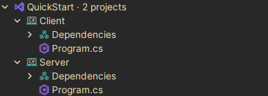

## Quick start

This is a tutorial with a simple scenario of using FatNetLib.

To start, create a solution and two projects - for the server and for the client, both projects will be console.



Then, we need to install the following NuGet packages with the same versions for both projects:

* [FatNetLib.Core](https://www.nuget.org/packages/FatNetLib.Core/) — the main package of the framework
* [FatNetLib.Json](https://www.nuget.org/packages/FatNetLib.Json/) — package for json serialization

Next, change Program.cs for server.

```c#
using Kolyhalov.FatNetLib.Core;
using Kolyhalov.FatNetLib.Core.Attributes;
using Kolyhalov.FatNetLib.Core.Microtypes;
using Kolyhalov.FatNetLib.Core.Middlewares;
using Kolyhalov.FatNetLib.Core.Modules.Defaults.Server;
using Kolyhalov.FatNetLib.Json;

var builder = new FatNetLibBuilder
{
    Modules =
    {
        new DefaultServerModule(),
        new JsonModule()
    },
    SendingMiddlewaresOrder = new[]
    {
        typeof(JsonSerializationMiddleware),
        typeof(EncryptionMiddleware)
    },
    ReceivingMiddlewaresOrder = new[]
    {
        typeof(DecryptionMiddleware),
        typeof(JsonDeserializationMiddleware)
    }
};

builder.Endpoints.AddExchanger(
    route: new Route("say-hello"),
    action: ([Body] string name) => $"Hello {name}");

FatNetLib fatNetLib = builder.BuildAndRun();

Console.ReadLine();

fatNetLib.Stop();
```

Here, we initialize FatNetLib as a server application with json serialization.
Learn more about [Initial configuration](../2-essentials/1-initial-configuration.md) and [Serialization](../2-essentials/7-serialization.md).
After that, we register an endpoint on the `say-hello` route.
This endpoint receives packages with a name and return packages with hello.
Learn more about [Endpoints](../2-essentials/2-endpoints.md).
Finally, we build and run the application.

Next, change the Program.cs for the client:

```c#
using Kolyhalov.FatNetLib.Core;
using Kolyhalov.FatNetLib.Core.Couriers;
using Kolyhalov.FatNetLib.Core.Microtypes;
using Kolyhalov.FatNetLib.Core.Middlewares;
using Kolyhalov.FatNetLib.Core.Models;
using Kolyhalov.FatNetLib.Core.Modules.Defaults.Client;
using Kolyhalov.FatNetLib.Json;
using static Kolyhalov.FatNetLib.Core.Constants.RouteConstants.Routes.Events;

var builder = new FatNetLibBuilder
{
    Modules =
    {
        new DefaultClientModule(),
        new JsonModule()
    },
    SendingMiddlewaresOrder = new[]
    {
        typeof(JsonSerializationMiddleware),
        typeof(EncryptionMiddleware)
    },
    ReceivingMiddlewaresOrder = new[]
    {
        typeof(DecryptionMiddleware),
        typeof(JsonDeserializationMiddleware)
    }
};

var connectedMonitor = new ManualResetEventSlim();
builder.Endpoints.AddEventListener(InitializationFinished, _ => connectedMonitor.Set());

FatNetLib fatNetLib = builder.BuildAndRun();
IClientCourier courier = fatNetLib.ClientCourier!;

Console.WriteLine("Waiting server");
connectedMonitor.Wait(TimeSpan.FromSeconds(5));

Console.WriteLine("Enter your name");
string name = Console.ReadLine()!;
Package response = (await courier.SendToServerAsync(new Package
{
    Route = new Route("say-hello"),
    Body = name
}))!;
Console.WriteLine($"Response from server: {response.Body}");

fatNetLib.Stop();
```

Here, we initialize FatNetLib as a client application with json serialization.
After that, we build and run the application and get a courier for sending packages.
Learn more about [Courier](../2-essentials/5-courier.md).
Next, we wait until the client connects to the server.
Finally, we ask for the username and send it in a package to the server.
Having received the response, we output it.

Now start the server and then the client.
Client console:

```
Waiting server
Enter your name
Vincent
Response from server: Hello Vincent 
```