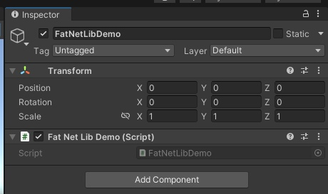
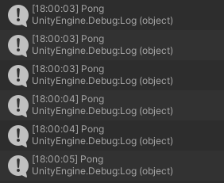

## Unity quick start

This is a tutorial with a simple scenario of using FatNetLib with Unity.

First, we will create a server.

Create a new console project and install the following nuget packages:

* [FatNetLib.Core]() — the main package of a framework
* [FatNetLib.Json]() — json serialization package

Now, change Program.cs:

```c#
using Kolyhalov.FatNetLib.Core;
using Kolyhalov.FatNetLib.Core.Attributes;
using Kolyhalov.FatNetLib.Core.Couriers;
using Kolyhalov.FatNetLib.Core.Microtypes;
using Kolyhalov.FatNetLib.Core.Middlewares;
using Kolyhalov.FatNetLib.Core.Models;
using Kolyhalov.FatNetLib.Core.Modules.Defaults.Server;
using Kolyhalov.FatNetLib.Core.Wrappers;
using Kolyhalov.FatNetLib.Json;

var builder = new FatNetLibBuilder
{
    Modules =
    {
        new DefaultServerModule(),
        new JsonModule()
    },
    SendingMiddlewaresOrder = new[]
    {
        typeof(JsonSerializationMiddleware),
        typeof(EncryptionMiddleware)
    },
    ReceivingMiddlewaresOrder = new[]
    {
        typeof(DecryptionMiddleware),
        typeof(JsonDeserializationMiddleware)
    }
};

builder.Endpoints.AddConsumer(
    route: new Route("ping"),
    action: async (ICourier courier, [Sender] INetPeer sender) =>
    {
        await Task.Delay(200);
        await courier.SendAsync(new Package
        {
            Route = new Route("pong"),
            Receiver = sender
        });
    });

FatNetLib fatNetLib = builder.BuildAndRun();

Console.ReadLine();

fatNetLib.Stop();
```

Here, we initialize FatNetLib as a server application with json serialization.
Learn more about [Initial configuration](../2-essentials/1-initial-configuration.md)
and [Serialization](../2-essentials/7-serialization.md).
After that, we register an endpoint on the `ping` route.
This endpoint sends the package to the sender at the `pong` route.
Learn more about [Endpoints](../2-essentials/2-endpoints.md).
Finally, we build and run the application.

Now create a new Unity project and install [unity package](https://github.com/VasiliyKolihalov/FatNetLib/releases/) with
the same version as the server:


After, create a new MonoBehaviour script in unity.

```c#
using System;
using System.Threading;
using System.Threading.Tasks;
using Kolyhalov.FatNetLib.Core;
using Kolyhalov.FatNetLib.Core.Couriers;
using Kolyhalov.FatNetLib.Core.Microtypes;
using Kolyhalov.FatNetLib.Core.Middlewares;
using Kolyhalov.FatNetLib.Core.Models;
using Kolyhalov.FatNetLib.Core.Modules.Defaults.Client;
using Kolyhalov.FatNetLib.Json;
using UnityEngine;
using static Kolyhalov.FatNetLib.Core.Constants.RouteConstants.Routes.Events;

public class FatNetLibDemo : MonoBehaviour
{
    private void Start()
    {
        var builder = new FatNetLibBuilder
        {
            Modules =
            {
                new DefaultClientModule(),
                new JsonModule()
            },
            SendingMiddlewaresOrder = new[]
            {
                typeof(JsonSerializationMiddleware),
                typeof(EncryptionMiddleware)
            },
            ReceivingMiddlewaresOrder = new[]
            {
                typeof(DecryptionMiddleware),
                typeof(JsonDeserializationMiddleware)
            }
        };
        builder.Endpoints.AddConsumer(
            new Route("pong"),
            (Func<ICourier, Task>)(async courier =>
            {
                Debug.Log("Pong");
                await Task.Delay(200);
                await (courier as ClientCourier)!.SendToServerAsync(new Package
                {
                    Route = new Route("ping")
                });
            }));

        var connectedMonitor = new ManualResetEventSlim();
        builder.Endpoints.AddEventListener(InitializationFinished, _ => connectedMonitor.Set());

        IClientCourier courier = builder.BuildAndRun()
            .ClientCourier!;

        
        connectedMonitor.Wait(TimeSpan.FromSeconds(5));

        courier.SendToServerAsync(new Package
        {
            Route = new Route("ping")
        });
    }
}
```

Here, we initialize FatNetLib as a client application with json serialization.
Then, we we register an endpoint on the `pong` route.
This endpoint sends the package to the server at the `ping` route.
After that, we build and run the application and get a courier for sending packages.
Learn more about [Courier](../2-essentials/5-courier.md).
Next, we wait for some time until the client connects to the server.
Finally, we send the package to the server at `ping` route to start the "ping-pong" call chain.

Next, create an empty object in a scene in Unity and add this script as a component:


Now start the server first and then the Unity client.
Unity client console:

