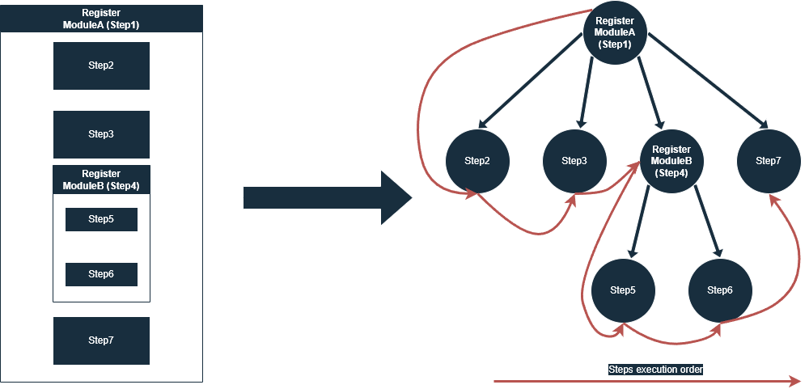

# Modules

Modules are components that are responsible for the FatNetLib assembly and configuration.
They are difficult to learn, but in return, they provide extremely flexible in-depth customization of the FatNetLib.

Using modules, you can:

* Register dependencies
* Register child modules, building a hierarchy
* Register controllers
* Register scripts
* Register middlewares
* Reorder middlewares
* Patch configuration
* Patch the DefaultPackageSchema

The final target of modules is to build the main class - `FatNetLib`.

## Registration application modules

Modules can be registered in two places: in `FatNetLibBuilder` and inside other modules.
To register in `FatNetLibBuilder` you need to use the `Modules` property.
The registration order is important because steps in modules are registered and
executed sequentially.

```c#
new FatNetLibBuilder
{
     Modules =
     {
         new DefaultClientModule(),
         new JsonModule(),
         new CompressionModule(CompressionLevel.Optimal)
     }
};
```

## Hierarchy

When module A registers module B, they build a hierarchy where A is the parent module and B is the child. It is not
allowed to register several child modules of the same type in one module.

```c#
public class AModule : IModule
{
     public void Setup(IModuleContext moduleContext)
     {
         moduleContext.PutModule(new BModule());
     }
}
```

Modules passed to `FatNetLibBuilder` will be registered as children of `RootModule`.
`RootModule` is the foundation and no modules can be its parent.
Based on the data passed to the `FatNetLibBuilder`, the `RootModule` registers the application
modules, executes the configuration patch, and reorders the middlewares.

## Setup modules

A module step is each action inside it, including adding child modules.
When a module is set up, its steps are just registered without execution, building a tree of steps.
When all modules setup, then the tree of steps is executed in in-depth traversal order



The modules do not take part in the further work of the application.

## Creating modules

To create a module, you need to implement the `IModule` interface.

```c#
public class MyModule : IModule
{
     public void Setup(IModuleContext moduleContext)
     {
        // Register steps here
     }
}
```

To add steps, you need to use `IModuleContext`.

When adding steps, a provider is often used — an instance of a delegate that takes a dependency context and returns
the object required for the step.
Dependency context allows you to get the necessary dependencies to create the object for step.

Also, many steps will not work without any dependencies that register standard
modules: `DefaultServerModule` and `DefaultClientModule`. Modules with such steps should be registered after the
standard modules.

### Registration dependencies

To register dependencies, you need to use the `PutDependency()` method. It takes the dependency identifier and
dependency provider. The dependency identifier must be unique because dependencies rewriting is not allowed.

```c#
public void Setup(IModuleContext moduleContext)
{
     moduleContext.PutDependency<MyEntity>(_ => _.Get<MyDependency>());
}
```

### Registration child modules

To register child modules, you need to use the `PutModule()` method. It accepts
instance of `IModule`. Remember that you cannot register several modules of the same type in one module.

### Registration of controllers

To register a controller, you need to use the `PutController<T>` method. It accepts a controller provider.

```c#
public void Setup(IModuleContext moduleContext)
{
     moduleContext.PutController<MyController>(_ => new MyController(_.Get<MyService>()));
}
```

### Registration scripts

Scripts are a universal tool that allows you to resolve complex situations.
To register a script you need to use the `PutScript()` method.
It takes the name of the script which allows it to identify it and delegate, which allows you to access dependency
context.
Scripts are reminiscent of methods, where the name of the script is the name of the method, and the delegate is
the body.

```c#
public void Setup(IModuleContext moduleContext)
{
     moduleContext.PutScript("AddConverter", _ =>
     {
         _.Get<IList<JsonConverter>>().Add(new MyConverter());
     });
}
```

### Registration middlewares

To register middleware, you need to use one of these methods:

* `PutSendingMiddleware<T>()` - add middleware to the *SendingMiddleware* pipeline
* `PutReceivingMiddleware<T>()` - add middleware to the *ReceivingMiddleware* pipeline

They accept the middleware provider.

```c#
public void Setup(IModuleContext moduleContext)
{
     moduleContext
         .PutSendingMiddleware(_ => new JsonSerializationMiddleware(_.Get<JsonSerializer>()));
}
```

Modules in which middlewares are registered must be registered after standard modules because the registering
middlewares steps use dependencies from standard modules.

### Reordering middlewares

To reorder middlewares, you need to use one of these methods:

* `ReorderSendingMiddlewares()` - reordering the *SendingMiddlewares* pipeline
* `ReorderReceivingMiddlewares()` - reordering the *ReceivingMiddlewares* pipeline

These methods accept a collection of middleware types by which the list of middlewares is reordered.
The reordering steps should be placed after the registration of all application middlewares.

```c#
public void Setup(IModuleContext moduleContext)
{
     moduleContext.ReorderSendingMiddlewares(new[]
     {
         typeof(JsonSerializationMiddleware),
         typeof(CompressionMiddleware),
         typeof(EncryptionMiddleware)
     });
     moduleContext.ReorderReceivingMiddlewares(new[]
     {
         typeof(DecryptionMiddleware),
         typeof(DecompressionMiddleware),
         typeof(JsonDeserializationMiddleware)
     });
}
```

Modules in which middlewares are reordering must be registered after standard modules because the reordering
middlewares steps use dependencies from standard modules.

### Configuration patch

To patch the configuration, you need to use the `PatchConfiguration()` method. It can take values of two
types: `ServerConfiguration` and `ClientConfiguration`. Choose the configuration type according to the type of your
application.

```c#
public void Setup(IModuleContext moduleContext)
{
     moduleContext.PatchConfiguration(new ServerConfiguration
     {
          Port = new Port(2812)
     });
}
```

You should not register a patch configuration step more than once in one module, because this step has empty qualifier.

Modules in which configuration are patching must be registered after standard modules because the patching
configuration steps use dependencies from standard modules.

### DefaultPackageSchema patch

To patch the DefaultPackageSchema, you need to use the `PatchDefaultPackageSchema()` method.

```c#
public void Setup(IModuleContext moduleContext)
{
     moduleContext.PatchDefaultPackageSchema(new PackageSchema
     {
         {"Field" : typeof(MyOwnType)}
     });
}
```

You should not register a patch configuration step more than once in one module, because this step has empty qualifier.

Modules in which DefaultPackageSchema are patching must be registered after standard modules because the patching
DefaultPackageSchema steps use dependencies from standard modules.

## Module correction

In addition to the steps that configure the framework, there are corrective steps, which change steps in
other modules.
They are needed to resolve conflicts between modules.
For example of conflict between modules, imagine this situation:
Module A and module B register dependency with the same name, and there is no possibility to change the
source code of these modules.
To resolve this conflict, we need to create module C, which find and delete one of these steps.

The correction directive consists of two parts: search and interaction.
The search area for steps is unlimited, but keep in mind that you can only interact with those steps that have not yet
been executed.

To work with correction steps, we need to use ModuleId and StepId.

### ModuleId

The module identifier is the path from `RootModule` to the target module,
consisting of a sequence of types representing modules in the path.
Let's consider an example:

```c#
new FatNetLibBuilder
{
     Modules =
     {
         new MyModule()
     }
};

public class MyModule : IModule
{
     public void Setup(IModuleContext moduleContext)
     {
         moduleContext.PutModule(new MyChildModule());
     }
}
```

The `ModuleId` for `MyModule` looks like this:

```c#
// RootModule/MyModule
new ModuleId(typeof(RootModule), typeof(MyModule))
```

And `MyChildModule`:

```c#
// RootModule/MyModule/ChildModule
new ModuleId(typeof(RootModule), typeof(MyModule), typeof(MyChildModule))
```

To make it easier to work with `ModuleId` there is a set of dynamic
pointers - `Kolyhalov.FatNetLib.Core.Modules.ModuleId.Pointers`.
The path without pointers is called absolute, and the path with pointers is called relative.

There are three pointers:

* `ThisModule` - the current module identifier
* `ParentModule` - the parent module identifier
* `RootModule` - the root module identifier

Pointers are convenient to use because `ModuleId` can be formed based on another `ModuleId`, by overloaded
operator `/`.

```c#
using static Kolyhalov.FatNetLib.Core.Modules.ModuleId.Pointers;

public class MyModule : IModule
{
     public void Setup(IModuleContext moduleContext)
     {
         moduleContext.PutModule(new MyChildModule());
        
         ModuleId thisModuleId = ThisModule;
         ModuleId myChildModuleId = ThisModule / typeof(MyChildModule);
         ModuleId moduleInRoot = RootModule / typeof(AnotherModule);
     }
}

```

Any relative path can be converted to an absolute path.

### StepId

The step identifier is `StepId`, this is a set of three properties:
`ParentModuleId` - the identifier of the module in which the step is registered,
`StepType` - describes a step action,
`Qualifier` - refinement necessary to distinguish steps of the same type in one module.

Some types of steps have empty qualifiers because it means that these steps can be registered once per module.

### Module correction steps

To remove a module, you need to find it with method `FindModule()` and use `AndRemoveIt()`.

Let's look at the example:

```c#
public class MyModule : IModule
{
     public void Setup(IModuleContext moduleContext)
     {
         moduleContext
             .FindModule(RootModule / typeof(DefaultClientModule) / typeof(ClientEncryptionModule))
             .AndRemoveIt();
     }
}
```

```c#
var builder = new FatNetLibBuilder
{
     Modules =
     {
         new MyModule(),
         new DefaultClientModule(),
     },
     // ...
};
```

In this example, we use the `MyModule` module to remove the `ClientEncryptionModule`, which is registered as a child
module for `DefaultClientModule`.
`MyModule` is intentionally registered earlier, because we can only delete those modules whose registration steps have
not yet been completed.

### Step correction steps

To change a sequence of steps in another module, you need to find it with method `FindStep()` method.

After finding, you can:

* `AndRemoveIt()` - removes the found step.
* `AndMoveBeforeStep()` - moves the found step, before the step whose `StepId` is passed.
* `AndMoveAfterStep()` - moves the found step, after the step whose `StepId` is passed.
* `AndReplaceOld()` - replaces the found step with the step whose `StepId` is passed.

Look at the example:

```c#
class ChildModule : IModule
{
    public void Setup(IModuleContext moduleContext)
    {
        moduleContext.PutDependency<IEntity>(_ => new NotDesiredEntityImplementation());
        // Other steps
    }
}
```

```c#
class MyModule : IModule
{
    public void Setup(IModuleContext moduleContext)
    {
        moduleContext
            .FindStep(
                parent: ThisModule / typeof(ChildModule),
                step: PutDependency,
                qualifier: typeof(IEntity))
            .AndReplaceOld(
                parent: ThisModule,
                step: PutDependency,
                qualifier: typeof(IEntity));
        moduleContext.PutDependency<IEntity>(_ => new DesiredEntityImplementation());
        moduleContext.PutModule(new ChildModule());
    }
}
```

```c#
var builder = new FatNetLibBuilder
{
    Modules =
    {
        new MyModule()
    },
    // ...
};
```

In this example there are two modules: `ChildModule` and `MyModule`.
`MyModule` register `ChildModule` as child.
`ChildModule` register a dependency, the implementation of which not desired.
In order to solve this, `MyModule` register a dependency,
the implementation of which desired and replaces the step which register an undesirable implementation in
the `ChildModule`.
