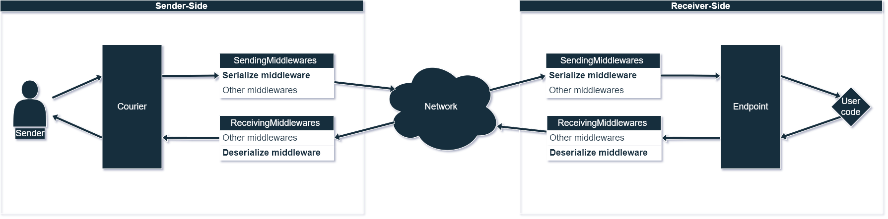
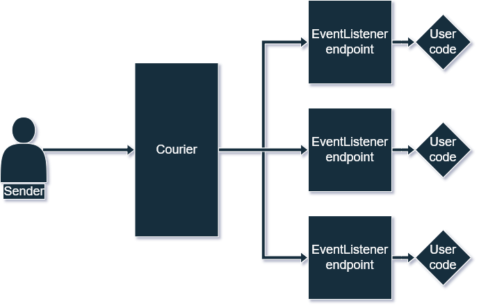

# Package

A package is a set of data to be sent once from sender to receiver. The data in the package is structured by fields.
The package field is an object, which is stored by key-string. The package can be represented as json:

```json
{
  "Route": "inventory-add",
  "Body": [
    {
      "Id": 1,
      "Count": 4
    },
    {
      "Id": 2,
      "Count": 1
    }
  ],
  "IsResponse": false
}
```

There are two types of fields in the package: sending and not-sending over the network.
Package fields formed throughout the life cycle.

## Life cycle

**If the package is for a network endpoint:**

**Sender-side**

1. The sender creates a package, for which it sets `Route`, `Receiver` and, usually, `Body`.
2. The sender passes the package to the `Courier`.
3. Package goes through all the `SendingMiddlewares`, among which there must be serialization middleware.
4. Value of the `Serialized` field is sent over the network.

**Receiver side**

5. An empty package is created. For the `Serialize` field, the sequence of bytes delivered over the network is set.
6. Package passes `ReceivingMiddlewares`, among which there must be deserialization middleware.
7. The target endpoint of the package is called
8. If the endpoint type provides for a response package, then it is collected in the body of the endpoint and returned.
   Next response package fields are set based on the request package: `Route`, `ExchangeId`, `IsResponse`, `Receiver`,
   and `Reliability`.
   After return the package passes `SendingMiddlewares`, among which there must be serialization middleware.
   At the end, value of the `Serialized` field sent over the network.

**Sender-side**

9. Then the sender will receive a response package, which will pass `ReceivingMiddlewares`, among which there will must
   be deserialization middleware and will return from Courier.



**If the package is for the event listener endpoint:**

1. A package is created for which a `Route` is set and, usually, `Body`.
2. The target endpoint of the package is called.



## Standard fields

The package provides a set of standard fields:

* Sending:
    * Route — endpoint route. Must be set before the package will be sent by courier.
    * Body — business-logic information. Optional field.
    * Error — error information. Can accept any type of data. Optional field.
    * ExchangeId — exchanger endpoint call identifier.
      Set automatically, but can be set manually if desired.
      It has the same value for the sending and for the response package.
    * IsResponse — whether the package is a response to an endpoint call. Set automatically.
    * SchemaPatch — schema patch for sent package fields.
      Is a way to specify the data type for Body, Error and other fields, the type of which is not known in advance.
      For standard fields, it is set automatically.
      Has the highest priority among schema patches.
* Not sending:
    * Serialized - serialized package to be sent over the network.
      Serialization is set in middlewares.
      Located 1in not-sent fields because its value is transmitted over the network.
    * Schema — final package schema.
      Collected from all SchemaPatch.
      [More about SchemaPatch and priorities](4-package-schema.md).
    * Context — access to dependency context. Set automatically.
    * Sender — the peer that sent the package, Set automatically.
    * Receiver — the peer the package is intended for. Must be set if the package is sent over the network.
    * Reliability — a guarantee of package delivery over the network.
      It is set according to the guarantee of the endpoint for which it is intended package.

## Custom fields

The package, in addition to standard fields, provides custom fields.

```c#
var package = new Package
{
     ["CustomSendingField"] = "value",
     NonSendingFields = { ["CustomNonSendingField"] = "value" }
};
```

You can use the package indexer to access the fields being sent. There is also a `Field` field for this. And for
access to non-sending fields there is a `NonSendingFields` field.

To get the values of custom fields, you can use the `GetField<T>()` and `GetNonSendingField<T>()` methods.
In them, values are unpacked.

```c#
var sendingFieldValue = package.GetField<string>("CustomSendingField");
var nonSendingFieldValue = package.GetNonSendingField<string>("CustomNonSendingField");
```