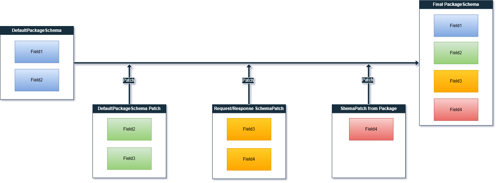

# PackageSchema

The package schema is a refinement of the type for package fields.
It is required for deserialization of the package
that was delivered over the network.

## Working with PackageSchema

The `PackageSchema` class is a key-value set, where the key is the field name, and the value is the field type.
The package schema allows you to specify the type of package field shallowly.
Since the `PackageSchema` class implements the `IEnumerable` interface, you can use the initializer when its creation.

```c#
new PackageSchema
{
    {nameof(Package.Body) : typeof(PlayerStats)},
    {nameof(Package.Error) : typeof(CustomErrorResponse)}
});
```

## DefaultPackageSchema

There is a DefaultPackageSchema. It is specified in `DefaultCommonModule` and specifies the types for the following
package fields:

```c#
new PackageSchema
{
    { nameof(Package.Route), typeof(Route) },
    { nameof(Package.Body), typeof(IDictionary<string, object>) },
    { nameof(Package.ExchangeId), typeof(Guid) },
    { nameof(Package.IsResponse), typeof(bool) },
    { nameof(Package.SchemaPatch), typeof(PackageSchema) }
});
```

## PackageSchema patch

Patching a package schema means adding new schema fields or redefining old ones without changing other fields.

When a package is delivered over the network, it is set to the DefaultPackageSchema. To patch it, you need to use
the `PatchDefaultPackageSchema` method in the module or the `DefaultPackageSchemaPatch` property in the builder. This
patch has the lowest priority because the default package schema is always the base schema for all other patches. Read
more about the [Patch Standard Package Schema from Module](10-modules.md).

Next, a patch of the endpoint package schema is applied to the standard package schema. If it is request package
then `RequestSchemaPatch` will be applied, if it is a response package, then `ResponseSchemaPatch` will be applied. It
is
set when registering an endpoint and is individual for it. It can also be set automatically. Read more
about [Automatic PackageSchemaPatch](2-endpoints.md).

After that, the patch from the `SchemaPatch` package field is applied. It is the final patch and has the highest
priority.

