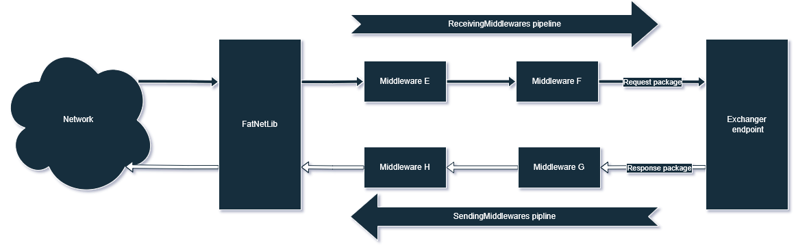
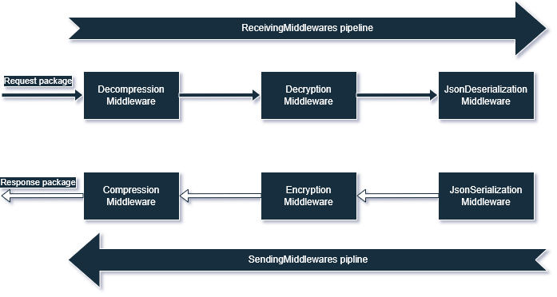

# Middlewares

Middlewares - are application components responsible for processing incoming and outgoing packages before they reach the
endpoints. Middlewares have a sequential execution order called a pipeline. There are two middleware pipelines: for
receiving packages - **ReceivingMiddlewares** and for sending - **SendingMiddlewares**.

Receiver side


Sender side:


Middlewares can completely modify the package by reading, adding, updating, and deleting package fields. Middlewares
are not intended for business logic. They serve as cross-cutting functionality. An example of cross-cutting
functionality is serialization/deserialization, encryption, or logging.

## Creation

To create middleware, you need to implement the `IMiddleware` interface.

```c#
public class MyMiddleware : IMiddleware
{
     public void Process(Package package)
     {
        // Some package manipulation code
     }
}
```

The `Process` method modifies the package. When the package passes the middlewares pipeline, all
changes are saved from the previous middleware to the next middleware. Then the modified package is passed to the
endpoint or the courier.

## Registration

Registration is adding middleware to the pipeline. For registration use `PutSendingMiddleware`
and `PutReceivingMiddleware` methods in modules. These methods put middlewares to the end of the pipelines.

```c#
public class MyModule : IModule
{
     public void Setup(IModuleContext moduleContext)
     {
         moduleContext
             .PutSendingMiddleware(_ => new JsonSerializationMiddleware(_.Get<JsonSerializer>()));
     }
}
```

You cannot register two middlewares with the same types in the one pipeline.

## Reordering

Often, once middlewares are registered, they will be in the wrong order. If the order of middlewares in the pipeline is
incorrect, the work of the application is disrupted. For example, if a package can get into the compression middleware
before the encryption middleware has passed. Then the compression middleware will not be able to correctly compress a
sequence of bytes because it is encrypted.

To set the correct order you can use the `FatNetLibBuilder` properties: `SendingMiddlewaresOrder`
and `ReceivingMiddlewaresOrder` or methods in `IModuleContext` : `ReorderSendingMiddlewares`
and `ReorderReceivingMiddlewares` .
These methods accept a collection of middleware types by which the list of middlewares is reordered.

Before reordering:


```c#
new FatNetLibBuilder
{
     SendingMiddlewaresOrder = new[]
     {
         typeof(JsonSerializationMiddleware),
         typeof(CompressionMiddleware),
         typeof(EncryptionMiddleware)
     },
     ReceivingMiddlewaresOrder = new[]
     {
         typeof(DecryptionMiddleware),
         typeof(DecompressionMiddleware),
         typeof(JsonDeserializationMiddleware)
     },
     // ...
};
```

```c#
public void Setup(IModuleContext moduleContext)
{
     moduleContext.ReorderSendingMiddlewares(new[]
     {
         typeof(JsonSerializationMiddleware),
         typeof(CompressionMiddleware),
         typeof(EncryptionMiddleware)
     });
     moduleContext.ReorderReceivingMiddlewares(new[]
     {
         typeof(DecryptionMiddleware),
         typeof(DecompressionMiddleware),
         typeof(JsonDeserializationMiddleware)
     });
}
```

After reordering:


If we set the order in modules, then it is desirable to do this at the very latest steps. Since middlewares can be
dependencies and must be registered before being ordered in the correct order. The order which is set by
the `FatNetLibBuilder`, has the highest priority.